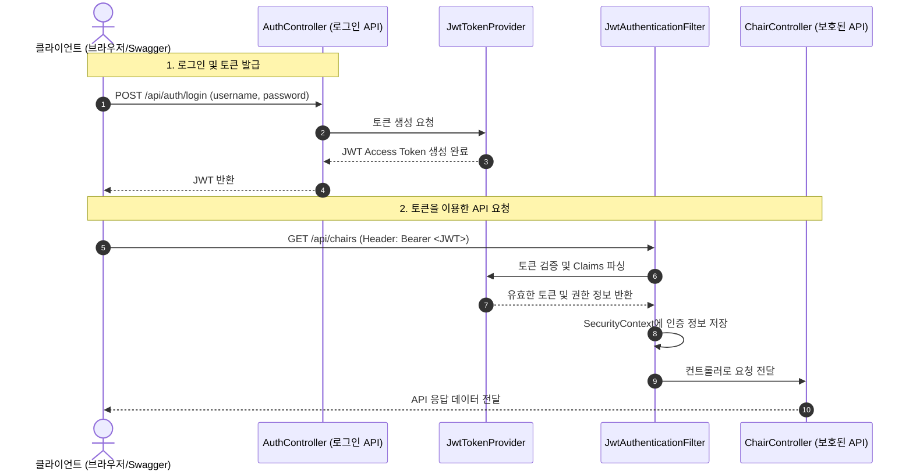

# 🔒 Spring Boot REST API Security & JWT 실습 프로젝트

본 프로젝트는 Spring Boot 환경에서 **Spring Security**와 **JWT (JSON Web Token)**를 활용하여 REST API 보안 및 인증 체계를 단계별로 구축한 실습 저장소입니다.

---

## 🛠️ 기술 스택
- **Framework**: Spring Boot 3.x, Spring Security 6.x
- **Database / ORM**: Spring Data JPA
- **Authentication**: JWT (JJWT 0.13.0)
- **API Documentation**: Springdoc OpenAPI (Swagger UI)

---

## 📝 실습 구현 내용 요약

실습은 기본 API 개발부터 Spring Security를 통한 기본적인 HTTP Basic 인증, 그리고 최종적으로 JWT 기반 인증 체계까지 점진적으로 고도화되었습니다.

### 1단계: 기본 도메인 설계 및 JPA 설정
* **JPA Auditing**: `BaseEntity`를 구현하여 생성일(`createdAt`)과 수정일(`modifiedAt`)을 자동으로 추적하도록 설정했습니다.
* **도메인 구현**: `ChairEntity` 및 관련 `ChairJpaRepository`, `ChairService` 레이어를 작성하고 CRUD 비즈니스 로직을 마련했습니다.

### 2단계: Spring Security 기본 설정 및 CORS/CSRF
* **CSRF 비활성화**: REST API 환경에 맞춰 CSRF 설정을 비활성화하고, `/api/chairs/**` 경로에 대한 권한 설정을 제공했습니다.
* **CORS 설정**: 외부 도메인에서의 API 접근을 허용하기 위해 `CorsConfigurationSource` Bean을 정의하고 Security 필터 체인에 연동했습니다.
* **정적 리소스**: 프론트엔드 테스트를 위한 정적 페이지(`index.html`) 경로를 시큐리티 예외 경로로 설정했습니다.

### 3단계: HTTP Basic 인증 & 예외 처리 커스터마이징
* **HTTP Basic Auth & Swagger**: 초기 단계로 HTTP Basic 인증을 설정하고 Swagger UI에서 테스트할 수 있도록 `basicAuth` 보안 스키마를 연동했습니다.
* **401 Unauthorized 처리**: 인증 실패 시 JSON 형태로 에러 응답을 반환하는 커스텀 `RestAuthenticationEntryPoint`를 구현했습니다.
* **403 Forbidden 처리**: 권한이 없는 자원에 접근(예: DELETE 요청 권한 제한)할 때 처리하는 커스텀 `RestAccessDeniedHandler`를 구현했습니다.

### 4단계: JWT 기반 인증 체계 전환 (최종)
HTTP Basic 인증의 한계를 극복하고 무상태(Stateless) 아키텍처를 구현하기 위해 JWT 방식을 도입했습니다.

* **JJWT 라이브러리 연동**: `jjwt-api`, `jjwt-impl`, `jjwt-jackson` (0.13.0 버전) 의존성을 구성했습니다.
* **JWT 속성 설정**: 비밀 키와 토큰 유효 기간 설정을 외부 환경 파일(`application-jwt.yaml`)로 분리하고 `JwtProperties` 클래스를 통해 타입 세이프하게 관리합니다.
* **JwtTokenProvider 구현**:
  * 사용자 정보를 바탕으로 JWT Access Token을 발급하는 기능
  * 요청에 포함된 JWT의 위변조 여부 및 만료일을 검증하는 기능
  * JWT 토큰 내부의 Claims에서 인증 정보(Username, Roles)를 추출하는 기능
* **로그인 API (`AuthController`)**: 아이디/패스워드 검증 후 성공 시 JWT 토큰을 발급하여 반환하는 `/api/auth/login` 엔드포인트를 구현했습니다.
* **JwtAuthenticationFilter (OncePerRequestFilter)**:
  * 모든 API 요청 시 HTTP 헤더(`Authorization: Bearer <TOKEN>`)에서 토큰을 추출합니다.
  * 토큰이 유효할 경우 `SecurityContextHolder`에 인증 객체(`Authentication`)를 보관하여 요청이 진행되는 동안 인증 상태를 유지하게 합니다.
* **필터 체인 등록 및 Swagger 연동**: `JwtAuthenticationFilter`를 `UsernamePasswordAuthenticationFilter` 이전에 수행하도록 설정하고, Swagger UI에 `bearerAuth`를 연동했습니다.

---

## 🔄 JWT 인증 흐름도 (Authentication Flow)

---

## 🚀 테스트 방법

### 1. Swagger UI 접속
* 애플리케이션 실행 후 `http://localhost:8080/swagger-ui.html`에 접속합니다.

### 2. 로그인 및 토큰 발급
* `AuthController`의 `/api/auth/login` API를 호출합니다. (기본 설정 아이디/비밀번호 확인 필요)
* 응답 결과로 발급받은 `token` 값을 복사합니다.

### 3. 인증 토큰 적용
* Swagger UI 우측 상단의 **Authorize** 버튼을 누릅니다.
* `bearerAuth` 스키마 항목에 복사한 JWT 토큰 값을 입력하고 적용합니다. (Bearer 키워드는 자동으로 붙습니다.)

### 4. 보호된 API 호출
* `/api/chairs` 등의 권한이 필요한 API를 호출하여 정상적으로 응답이 오는지 테스트합니다.
