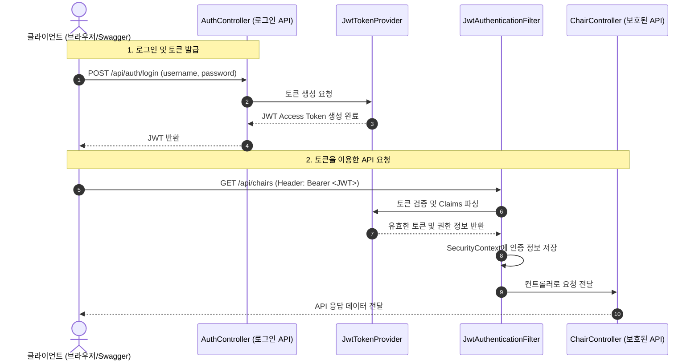

# 🔒 Spring Boot REST API Security & JWT 실습 프로젝트

<!-- workspace-readme-learning:start -->
## 파일과 연결한 학습 안내

아래 설명은 이 폴더의 실제 소스와 빌드 설정을 기준으로 정리했습니다. 기존 소개의 기능 설명은 연결된 파일과 함께 확인할 수 있습니다.

### 주요 파일과 역할

| 파일 | 역할과 읽을 내용 |
| --- | --- |
| [build.gradle](<build.gradle>) | Gradle 플러그인·JDK·의존성과 빌드 작업 설정 |
| [src/main/java/org/example/restsec/controller/AuthController.java](<src/main/java/org/example/restsec/controller/AuthController.java>) | 요청 매핑·입력 바인딩과 응답 처리 — `login`, `LoginDTO`, `AccessTokenDTO` |
| [src/main/java/org/example/restsec/controller/ChairController.java](<src/main/java/org/example/restsec/controller/ChairController.java>) | 요청 매핑·입력 바인딩과 응답 처리 — `deleteChair`, `saveChair`, `ChairRequest` |
| [src/main/java/org/example/restsec/RestSecApplication.java](<src/main/java/org/example/restsec/RestSecApplication.java>) | Spring Boot 애플리케이션 진입점 — `main` |
| [src/main/resources/static/index.html](<src/main/resources/static/index.html>) | CORS 화면 |
| [src/main/java/org/example/restsec/repository/ChairJpaRepository.java](<src/main/java/org/example/restsec/repository/ChairJpaRepository.java>) | Spring Data의 엔티티 저장·조회 계약 |
| [src/main/java/org/example/restsec/service/ChairService.java](<src/main/java/org/example/restsec/service/ChairService.java>) | 업무 처리와 외부 의존성 호출 — `findAll`, `save` |
| [HELP.md](<HELP.md>) | 설계·학습·운영 내용을 설명하는 문서 |
| [settings.gradle](<settings.gradle>) | 프로젝트 구성 자료 |
| [src/main/java/org/example/restsec/auth/JwtAuthenticationFilter.java](<src/main/java/org/example/restsec/auth/JwtAuthenticationFilter.java>) | Java 타입과 동작 정의 |
| [src/main/java/org/example/restsec/auth/JwtProperties.java](<src/main/java/org/example/restsec/auth/JwtProperties.java>) | 빈 등록 또는 외부 설정 구성 — `JwtProperties` |
| [src/main/java/org/example/restsec/auth/JwtTokenProvider.java](<src/main/java/org/example/restsec/auth/JwtTokenProvider.java>) | Java 타입과 동작 정의 — `createAccessToken`, `parseClaims` |
| [src/main/java/org/example/restsec/auth/RestAccessDeniedHandler.java](<src/main/java/org/example/restsec/auth/RestAccessDeniedHandler.java>) | Java 타입과 동작 정의 — `handle` |
| [src/main/java/org/example/restsec/auth/RestAuthenticationEntryPoint.java](<src/main/java/org/example/restsec/auth/RestAuthenticationEntryPoint.java>) | Java 타입과 동작 정의 — `commence` |
| [src/main/java/org/example/restsec/config/JpaConfig.java](<src/main/java/org/example/restsec/config/JpaConfig.java>) | 빈 등록 또는 외부 설정 구성 |
| [src/main/java/org/example/restsec/config/SecurityConfig.java](<src/main/java/org/example/restsec/config/SecurityConfig.java>) | 빈 등록 또는 외부 설정 구성 — `securityFilterChain`, `corsConfigurationSource` |
| [src/main/java/org/example/restsec/config/SwaggerUIConfig.java](<src/main/java/org/example/restsec/config/SwaggerUIConfig.java>) | 빈 등록 또는 외부 설정 구성 |
| [src/main/java/org/example/restsec/entity/BaseEntity.java](<src/main/java/org/example/restsec/entity/BaseEntity.java>) | Java 타입과 동작 정의 |

### 실행과 설정 확인

- [build.gradle](<build.gradle>)의 플러그인과 의존성을 기준으로 구성합니다. 선언된 Java toolchain은 17입니다.
- Windows에서는 저장소 루트에서 `.\gradlew.bat bootRun`을 사용합니다.
- 환경 설정: [src/main/resources/application-jwt.yaml](<src/main/resources/application-jwt.yaml>), [src/main/resources/application.yaml](<src/main/resources/application.yaml>).
- 코드·설정에서 참조하는 환경 변수 이름: `JWT_SECRET`, `PGDATABASE`, `PGHOST`, `PGPASSWORD`, `PGUSER`. 기본값과 필수 여부는 각 참조 위치에서 확인합니다.

### 관련 PDF와 보충 설명

- [7/3 강의](<../260629_ex/새 폴더/7-3/README.md>): 쿠키·세션·필터의 상태 식별과 요청 제어를 연결합니다.
- [6/1 강의](<../260629_ex/새 폴더/6-1/README.md>): HTTP 메서드·본문·응답 파싱을 실제 API 호출과 연결합니다.

이 링크는 구현을 이해하기 위한 관련 기초 자료입니다. 해당 강의가 이 저장소의 모든 기능이나 이후 버전의 API를 설명한다는 뜻은 아닙니다.

### 읽는 순서와 복습

- 로그인 상태 생성 → 세션 식별 → 공통 필터 → 접근 허용·거부를 추적합니다. 로그인 성공·실패·만료·로그아웃과 권한 없는 접근을 구분합니다.
- 요청 생성 → 상태 코드 확인 → 응답 변환 → 화면 또는 출력 반영을 추적합니다. 정상 응답, HTTP 오류, 연결 실패와 빈 응답을 구분합니다.

인증된 사용자와 요청 대상의 소유권 검사는 별개입니다. 토큰 유효성 확인 뒤 실제 권한을 검사하는 코드를 찾아 로그인·만료·접근 거부 경로를 비교합니다.

테스트 소스가 포함되어 있습니다. 이 문서 수정 작업에서는 애플리케이션·DB·외부 API 테스트를 실행하지 않았으므로 실행 결과를 보장하는 기록은 아닙니다.

<!-- workspace-readme-learning:end -->

본 프로젝트는 Spring Boot 환경에서 **Spring Security**와 **JWT (JSON Web Token)**를 활용하여 REST API 보안 및 인증 체계를 단계별로 구축한 실습 저장소입니다.

---

## 🛠️ 기술 스택
- **Framework**: Spring Boot 3.x, Spring Security 6.x
- **Database / ORM**: Spring Data JPA
- **Authentication**: JWT (JJWT 0.13.0)
- **API Documentation**: Springdoc OpenAPI (Swagger UI)

---

## 📝 실습 구현 내용 요약

실습은 기본 API 개발부터 Spring Security를 통한 기본적인 HTTP Basic 인증, 그리고 최종적으로 JWT 기반 인증 체계까지 점진적으로 고도화되었습니다.

### 1단계: 기본 도메인 설계 및 JPA 설정
* **JPA Auditing**: `BaseEntity`를 구현하여 생성일(`createdAt`)과 수정일(`modifiedAt`)을 자동으로 추적하도록 설정했습니다.
* **도메인 구현**: `ChairEntity` 및 관련 `ChairJpaRepository`, `ChairService` 레이어를 작성하고 CRUD 비즈니스 로직을 마련했습니다.

### 2단계: Spring Security 기본 설정 및 CORS/CSRF
* **CSRF 비활성화**: REST API 환경에 맞춰 CSRF 설정을 비활성화하고, `/api/chairs/**` 경로에 대한 권한 설정을 제공했습니다.
* **CORS 설정**: 외부 도메인에서의 API 접근을 허용하기 위해 `CorsConfigurationSource` Bean을 정의하고 Security 필터 체인에 연동했습니다.
* **정적 리소스**: 프론트엔드 테스트를 위한 정적 페이지(`index.html`) 경로를 시큐리티 예외 경로로 설정했습니다.

### 3단계: HTTP Basic 인증 & 예외 처리 커스터마이징
* **HTTP Basic Auth & Swagger**: 초기 단계로 HTTP Basic 인증을 설정하고 Swagger UI에서 테스트할 수 있도록 `basicAuth` 보안 스키마를 연동했습니다.
* **401 Unauthorized 처리**: 인증 실패 시 JSON 형태로 에러 응답을 반환하는 커스텀 `RestAuthenticationEntryPoint`를 구현했습니다.
* **403 Forbidden 처리**: 권한이 없는 자원에 접근(예: DELETE 요청 권한 제한)할 때 처리하는 커스텀 `RestAccessDeniedHandler`를 구현했습니다.

### 4단계: JWT 기반 인증 체계 전환 (최종)
HTTP Basic 인증의 한계를 극복하고 무상태(Stateless) 아키텍처를 구현하기 위해 JWT 방식을 도입했습니다.

* **JJWT 라이브러리 연동**: `jjwt-api`, `jjwt-impl`, `jjwt-jackson` (0.13.0 버전) 의존성을 구성했습니다.
* **JWT 속성 설정**: 비밀 키와 토큰 유효 기간 설정을 외부 환경 파일(`application-jwt.yaml`)로 분리하고 `JwtProperties` 클래스를 통해 타입 세이프하게 관리합니다.
* **JwtTokenProvider 구현**:
  * 사용자 정보를 바탕으로 JWT Access Token을 발급하는 기능
  * 요청에 포함된 JWT의 위변조 여부 및 만료일을 검증하는 기능
  * JWT 토큰 내부의 Claims에서 인증 정보(Username, Roles)를 추출하는 기능
* **로그인 API (`AuthController`)**: 아이디/패스워드 검증 후 성공 시 JWT 토큰을 발급하여 반환하는 `/api/auth/login` 엔드포인트를 구현했습니다.
* **JwtAuthenticationFilter (OncePerRequestFilter)**:
  * 모든 API 요청 시 HTTP 헤더(`Authorization: Bearer <TOKEN>`)에서 토큰을 추출합니다.
  * 토큰이 유효할 경우 `SecurityContextHolder`에 인증 객체(`Authentication`)를 보관하여 요청이 진행되는 동안 인증 상태를 유지하게 합니다.
* **필터 체인 등록 및 Swagger 연동**: `JwtAuthenticationFilter`를 `UsernamePasswordAuthenticationFilter` 이전에 수행하도록 설정하고, Swagger UI에 `bearerAuth`를 연동했습니다.

---

## 🔄 JWT 인증 흐름도 (Authentication Flow)

---

## 🚀 테스트 방법

### 1. Swagger UI 접속
* 애플리케이션 실행 후 `http://localhost:8080/swagger-ui.html`에 접속합니다.

### 2. 로그인 및 토큰 발급
* `AuthController`의 `/api/auth/login` API를 호출합니다. (기본 설정 아이디/비밀번호 확인 필요)
* 응답 결과로 발급받은 `token` 값을 복사합니다.

### 3. 인증 토큰 적용
* Swagger UI 우측 상단의 **Authorize** 버튼을 누릅니다.
* `bearerAuth` 스키마 항목에 복사한 JWT 토큰 값을 입력하고 적용합니다. (Bearer 키워드는 자동으로 붙습니다.)

### 4. 보호된 API 호출
* `/api/chairs` 등의 권한이 필요한 API를 호출하여 정상적으로 응답이 오는지 테스트합니다.

<!-- pdf-til-supplement:start -->
## TIL 부연 설명 — PDF와 연결하기

기존 실습 내용을 이해하기 위한 PDF 기반 부연 설명이다. 아래 예시는 개념을 설명하기 위한 것이며, 이 프로젝트에서 실행해 관찰한 결과와는 구분한다. 페이지 번호는 표지를 포함한 PDF 순서다.

함께 읽을 파일: [src/main/java/org/example/restsec/controller/AuthController.java](<src/main/java/org/example/restsec/controller/AuthController.java>) · [src/main/java/org/example/restsec/controller/ChairController.java](<src/main/java/org/example/restsec/controller/ChairController.java>) · [src/main/java/org/example/restsec/RestSecApplication.java](<src/main/java/org/example/restsec/RestSecApplication.java>)

### 보안 필터의 오류와 컨트롤러 오류

보안 필터에서 차단된 요청은 컨트롤러까지 도달하지 않을 수 있어 ControllerAdvice만으로 모든 오류를 처리할 수 없다. 인증 실패는 AuthenticationEntryPoint, 접근 거부는 AccessDeniedHandler 같은 보안 계층의 처리 지점과 연결한다. 401과 403을 구분해야 클라이언트도 로그인과 권한 부족을 다르게 안내한다.

**예시로 이해하기:** 구체적인 허용 규칙을 앞에 두고 포괄 규칙을 뒤에 두는 순서를 읽는다. JWT 또는 REST라는 이름만으로 CSRF를 꺼도 된다고 판단하지 않는다. 쿠키처럼 브라우저가 자격 증명을 자동 전송하는지와 실제 인증 방식을 기준으로 검토한다.

근거: 423 Spring Security와 REST API 인증인가 — [13쪽](<../260629_ex/새 폴더/8-18/423_Spring_Security와_REST_API_인증인가.pdf#page=13>) · [25쪽](<../260629_ex/새 폴더/8-18/423_Spring_Security와_REST_API_인증인가.pdf#page=25>) · [27쪽](<../260629_ex/새 폴더/8-18/423_Spring_Security와_REST_API_인증인가.pdf#page=27>) · [33쪽](<../260629_ex/새 폴더/8-18/423_Spring_Security와_REST_API_인증인가.pdf#page=33>) · [35쪽](<../260629_ex/새 폴더/8-18/423_Spring_Security와_REST_API_인증인가.pdf#page=35>) · [36쪽](<../260629_ex/새 폴더/8-18/423_Spring_Security와_REST_API_인증인가.pdf#page=36>)

### JWT를 읽는 것과 검증하는 것의 차이

JWT의 payload는 Base64URL로 표현되며 일반적으로 누구나 디코딩할 수 있다. 서명은 내용 변조를 검증하는 수단이지 본문을 숨기는 암호화가 아니다. 서버는 서명·만료와 앱이 요구하는 클레임을 검증한 뒤 인증 객체를 만들어야 한다.

**예시로 이해하기:** 토큰에서 사용자 ID를 읽었다는 이유만으로 인증을 통과시키면 안 된다. Bearer 토큰 추출 → 검증 → SecurityContext 구성 → 인가 순서로 읽는다. 클라이언트가 토큰을 삭제해도 복사된 토큰은 만료 전까지 유효할 수 있어 로그아웃 정책과 별도로 생각해야 한다.

근거: 424-1 JWT 기반 무상태 인증 — [15쪽](<../260629_ex/새 폴더/8-18/424-1_JWT_기반_무상태_인증.pdf#page=15>) · [17쪽](<../260629_ex/새 폴더/8-18/424-1_JWT_기반_무상태_인증.pdf#page=17>) · [18쪽](<../260629_ex/새 폴더/8-18/424-1_JWT_기반_무상태_인증.pdf#page=18>) · [20쪽](<../260629_ex/새 폴더/8-18/424-1_JWT_기반_무상태_인증.pdf#page=20>) · [29쪽](<../260629_ex/새 폴더/8-18/424-1_JWT_기반_무상태_인증.pdf#page=29>) · [39쪽](<../260629_ex/새 폴더/8-18/424-1_JWT_기반_무상태_인증.pdf#page=39>)

### 오류 응답을 클라이언트가 처리할 수 있게 만들기

REST의 오류 응답은 상태 코드와 일관된 본문이 함께 있어야 한다. ProblemDetail의 type·title·status·detail·instance는 오류의 종류와 상황을 표현하고 필요한 필드 오류는 확장 정보로 추가할 수 있다. 도메인 예외를 HTTP 응답으로 바꾸는 책임을 공통 처리기에 모으면 중복을 줄인다.

**예시로 이해하기:** 없는 글은 404, 입력 검증 실패는 400처럼 클라이언트가 대응을 구분할 수 있게 한다. 서버의 SQL·스택 추적·비밀 설정을 응답에 담지 않고 요청 식별자로 로그와 연결한다. 실제 HTTP 상태와 본문의 status가 일치하는지도 확인한다.

근거: 421-2 REST API 예외 처리와 문서화 — [9쪽](<../260629_ex/새 폴더/8-13/421-2_REST_API_예외_처리와_문서화.pdf#page=9>) · [17쪽](<../260629_ex/새 폴더/8-13/421-2_REST_API_예외_처리와_문서화.pdf#page=17>) · [18쪽](<../260629_ex/새 폴더/8-13/421-2_REST_API_예외_처리와_문서화.pdf#page=18>) · [31쪽](<../260629_ex/새 폴더/8-13/421-2_REST_API_예외_처리와_문서화.pdf#page=31>) · [39쪽](<../260629_ex/새 폴더/8-13/421-2_REST_API_예외_처리와_문서화.pdf#page=39>)

<!-- pdf-til-supplement:end -->
